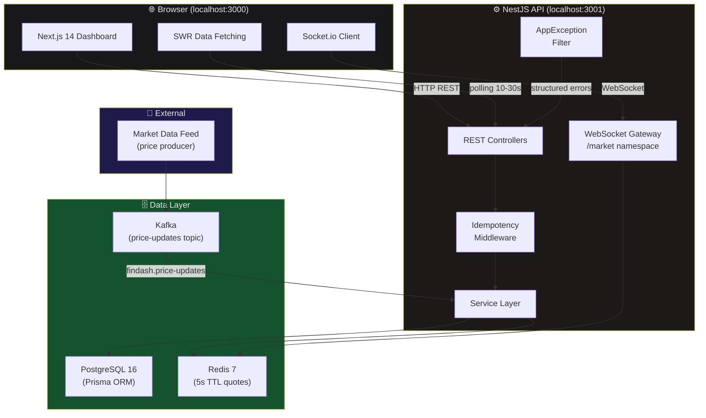
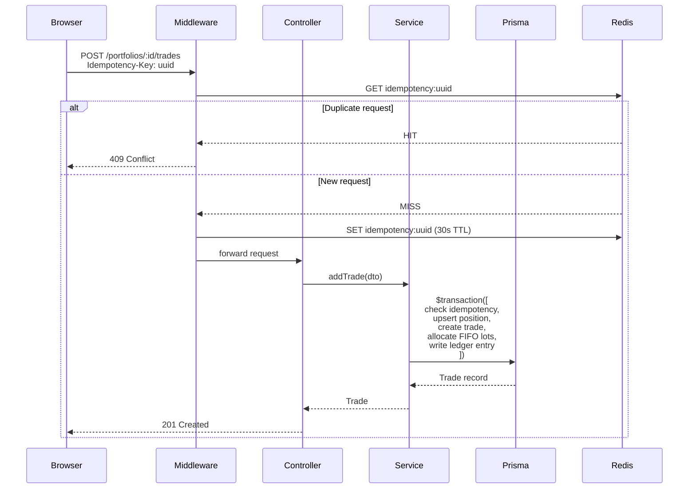
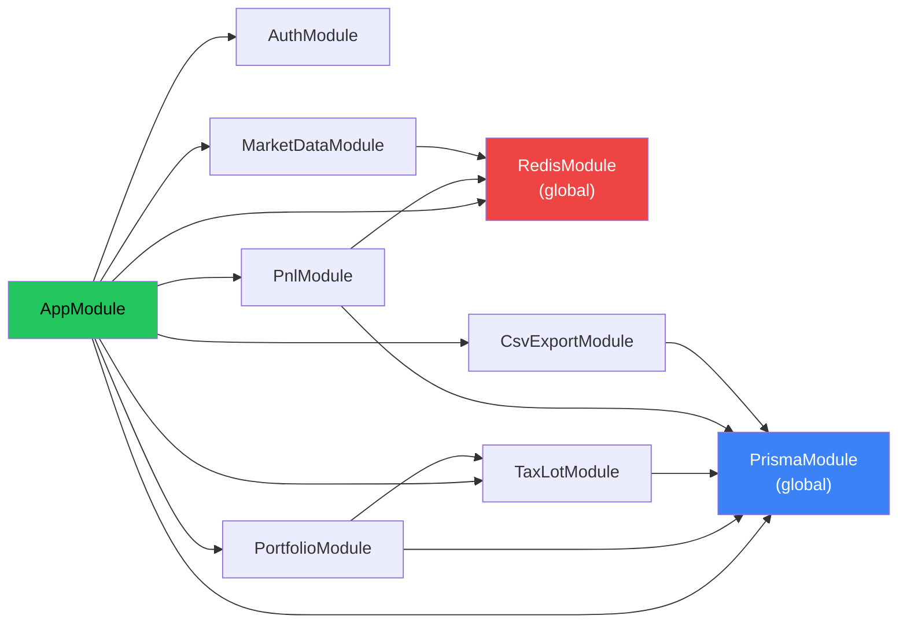
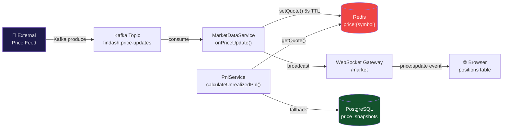

# FinDash — System Architecture

## Overview

FinDash is a **real-time portfolio tracker** built on the fintech CodeDNA archetype. It follows a strict layered architecture — every financial operation is transactional, append-only, and cent-accurate.

---

## High-Level System Architecture

---

## Request Lifecycle

---

## Module Dependency Graph

---

## Real-Time Price Data Flow

