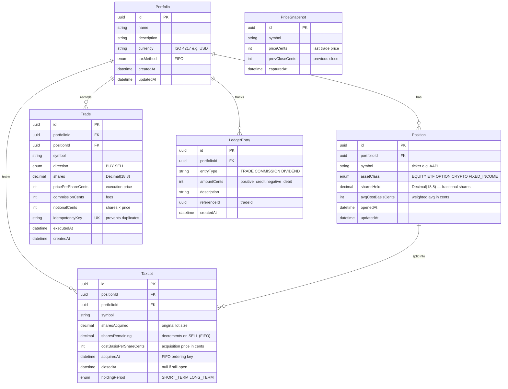

# FinDash — Data Model

## Entity Relationship Diagram



---

## Key Design Decisions

### All Amounts in Cents (Int)
```
$150.25 → 15025 cents
 -$3.99 → -399 cents
```
Never store floats for money. Eliminates floating-point rounding errors in FIFO calculations.

### Append-Only Tables

| Table | Mutable? | Reason |
|-------|----------|--------|
| `trades` | ❌ Never | Immutable audit trail |
| `tax_lots` | Partial | Only `sharesRemaining`, `closedAt`, `holdingPeriod` update |
| `ledger_entries` | ❌ Never | Double-entry integrity |
| `positions` | ✅ Yes | Aggregate view — `sharesHeld`, `avgCostBasisCents` |
| `portfolios` | ✅ Yes | Metadata only |

### Idempotency Key (Unique Constraint)

Every trade mutation requires a client-generated UUID in the `Idempotency-Key` header. Stored as a unique column on `trades` — duplicate submissions get a `409 Conflict` rather than a double-booking.

### Double-Entry Ledger

Every trade creates two `ledger_entries`:
```
BUY  50 AAPL @ $165 → debit  $8,250.00 (amountCents: -825000)
                     → debit  $0.99 commission (amountCents: -99)

SELL 30 AAPL @ $185 → credit $5,550.00 (amountCents: +555000)
                     → debit  $0.99 commission (amountCents: -99)
```

---

## Indexes

| Table | Index | Purpose |
|-------|-------|---------|
| `positions` | `(portfolioId, symbol)` UNIQUE | One position per symbol per portfolio |
| `tax_lots` | `(positionId, acquiredAt)` | FIFO ordering — oldest first |
| `trades` | `(portfolioId, executedAt)` | Time-series queries |
| `trades` | `idempotencyKey` UNIQUE | Duplicate rejection |
| `price_snapshots` | `(symbol, capturedAt)` | Latest price lookup |
