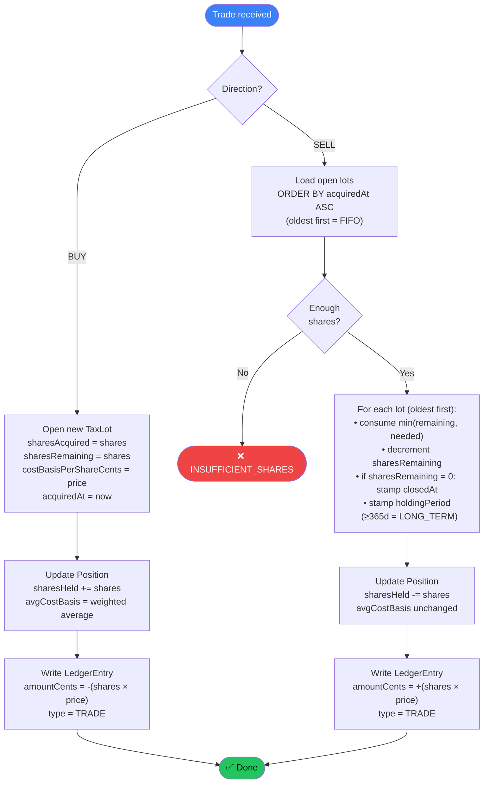
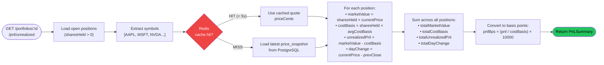
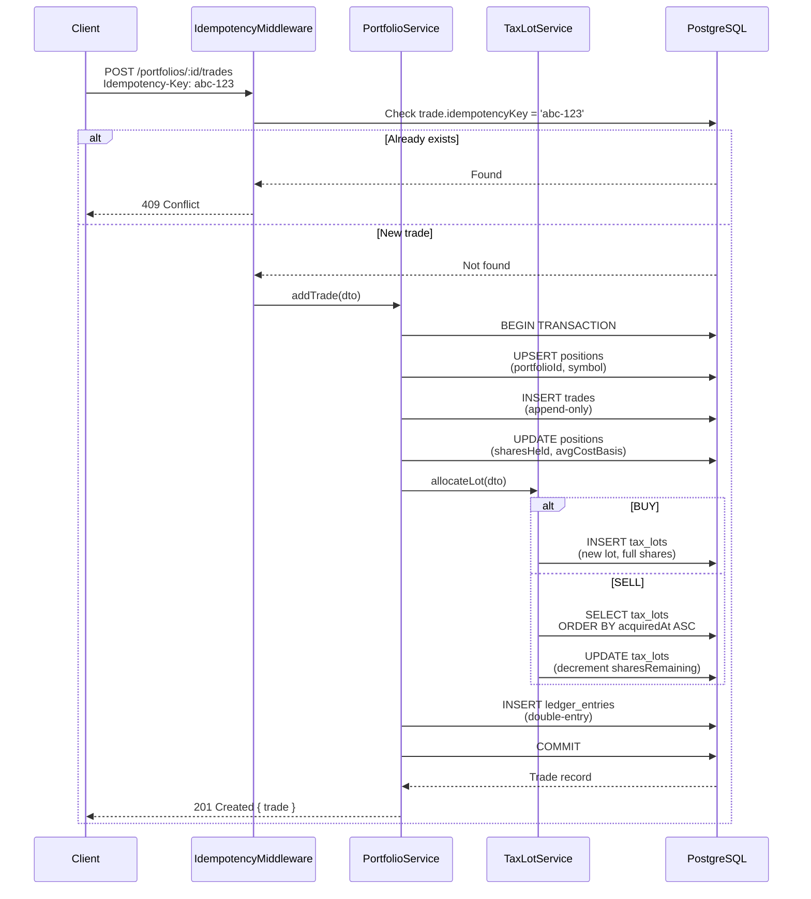
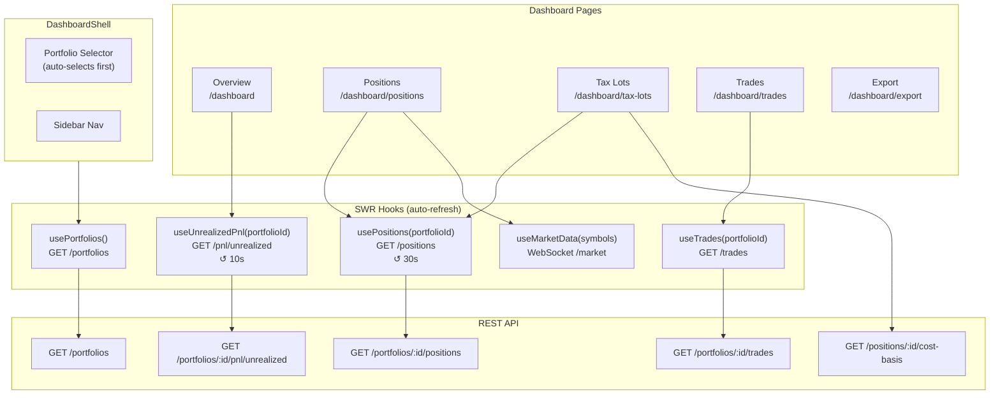

# FinDash — System Flows

## 1. FIFO Tax-Lot Allocation Flow

The core fintech logic — how shares are allocated on BUY and consumed on SELL.



### FIFO Example

```
Initial lots (oldest first):
  Lot 1: 50 shares @ $165  (acquired day 1)
  Lot 2: 25 shares @ $150  (acquired day 2)

SELL 30 shares:
  → consume 30 from Lot 1 (50 → 20 remaining)
  → Lot 2 untouched

Result:
  Lot 1: sharesRemaining = 20  (still open)
  Lot 2: sharesRemaining = 25  (untouched)
  Position: sharesHeld = 45
```

---

## 2. Unrealized P&L Calculation Flow



---

## 3. Trade Recording Flow (Full Transaction)



---

## 4. Frontend Data Flow



---

## 5. CSV Export Flow

```mermaid
flowchart LR
    USER(["User clicks\nDownload"]) --> PANEL["CsvExportPanel\nselects: Trades or Tax Lots\napplies: date range, symbol filter"]
    PANEL -->|"GET /export/trades"| CTRL["CsvExportController"]
    CTRL --> SVC["CsvExportService\nexportTrades(portfolioId, filters)"]
    SVC --> PRISMA["Prisma query\nwith filters applied"]
    PRISMA --> DATA["Raw trade rows\n(amounts in cents)"]
    DATA --> FORMAT["csv-stringify\n• adds USD columns (cents ÷ 100)\n• formats dates ISO 8601\n• adds headers"]
    FORMAT --> BUFFER["Buffer (text/csv)"]
    BUFFER --> RESPONSE["HTTP Response\nContent-Disposition: attachment\nfilename: trades_<id>_<date>.csv"]
    RESPONSE --> DOWNLOAD(["💾 File downloaded\nto user's machine"])

    style USER fill:#3b82f6,color:#fff
    style DOWNLOAD fill:#22c55e,color:#000
```


